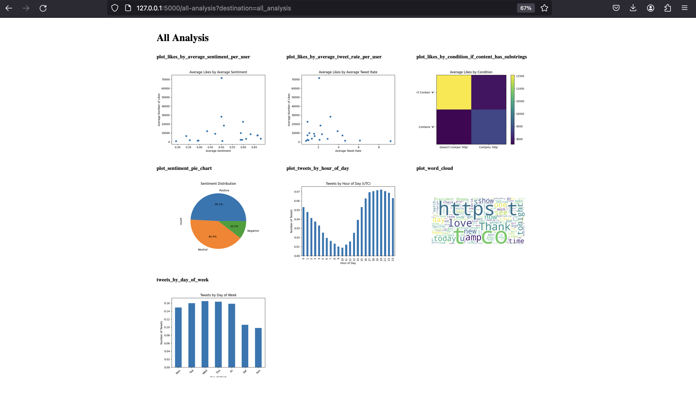

# Twitter_analysis_v2

Final Project - Twitter Insight Engine using Kubernetes

The Tweet Analysis Web Application is a Flask-based web application that allows users to perform various analyses on tweet data. Users can input data, choose analysis options, and visualize the results ,also they have the option to tweet their input using the Twitter API .

## Roadmap

- [Mockup](#mockup)
- [Environment Variables](#environment-variables)
- [run locally](#run-locally)
- [Deployment](#deployment)
- [services](#services)
  - [Analysis Folder](#analysis)
  - [Api Folder](#api)
  - [App Folder](#app)
- [Kubernetes](#kubernetes)

## Mockup




# Environment Variables

To run this project, you will need to add the following environment variables to your .env file

`CONSUMER_KEY`

`CONSUMER_SECRET`

`ACCESS_TOKEN`

`ACCESS_TOKEN_SECRET`

`BEARER_TOKEN`

## Integrated Technologies

[Docker]: https://img.shields.io/badge/Docker-2496ED?style=for-the-badge&logo=docker&logoColor=white
[Docker-url]: https://www.docker.com
[Docker Desktop]: https://img.shields.io/badge/Docker%20Desktop-2496ED?style=for-the-badge&logo=docker&logoColor=white
[Docker Desktop-url]: https://www.docker.com/products/docker-desktop
[Kubernetes]: https://img.shields.io/badge/Kubernetes-326CE5?style=for-the-badge&logo=kubernetes&logoColor=white
[Kubernetes-url]: https://kubernetes.io
[Kubernetes CLI (kubectl)]: https://img.shields.io/badge/Kubernetes%20CLI%20kubectl-326CE5?style=for-the-badge&logo=kubernetes&logoColor=white
[Kubernetes CLI (kubectl)-url]: https://kubernetes.io/docs/reference/kubectl/overview/
[MongoDB]: https://img.shields.io/badge/MongoDB-47A248?style=for-the-badge&logo=mongodb&logoColor=white
[MongoDB-url]: https://www.mongodb.com

[](https://www.docker.com)
[](https://www.docker.com/products/docker-desktop)
[](https://kubernetes.io)
[](https://kubernetes.io/docs/reference/kubectl/overview/)
[](https://www.mongodb.com)

## Run Locally

Clone the project

```bash
  git clone git@github.com:razyal8/twitter_analysis_v2.git

  git clone https://github.com/razyal8/twitter_analysis_v2.git
```

Go to the project directory

```bash
  cd twitter_analysis_v2
```

## Deployment

To deploy this project to your local kubernetes and run locally you need to:

#### build the images

##### build & push analysis image to docker-desktop

```bash
docker build -t razyal/analysis:v1.0.0 ./analysis

docker push -t razyal/analysis:v1.0.0

```

##### build api image

```bash
docker build -t razyal/analysis:v1.0.0 ./api

docker push -t razyal/api:v1.0.0

```

##### build app image

```bash
docker build -t razyal/analysis:v1.0.0 ./app

docker push -t razyal/app:v1.0.0

```

#### Deploy db

```bash
  kubectl apply -f kubernetes/db/security.yaml

  kubectl apply -f kubernetes/db/deployment.yaml

  kubectl apply -f kubernetes/db/service.yaml
```

#### Deploy Api service

```bash
  kubectl apply -f kubernetes/api/deployment.yaml

  kubectl apply -f kubernetes/api/service.yaml
```

#### Deploy analysis service

```bash
  kubectl apply -f kubernetes/analysis/deployment.yaml

  kubectl apply -f kubernetes/analysis/service.yaml
```

#### Deploy App service

```bash
  kubectl apply -f kubernetes/app/deployment.yaml

  kubectl apply -f kubernetes/app/service.yaml
```

after the deployments you should get : 

  

#### RUN local

```bash
  kubectl port-forward -n tweet-project service/myapp-service 5000:80
```

### localhost:5000

# services

## Analysis

This repository contains scripts for analyzing Twitter data stored in MongoDB. The analysis includes various visualizations and insights derived from the tweet data.

### 📁 Folder Structure

- **data/**: Contains Excel files with tweet data.
- **analysis/**: Contains scripts for data processing, analysis, and visualization.
- **dockerfile**: Dockerfile for containerizing the application.
- **server.py**: Flask server script to expose APIs for data analysis.
- **database.py**: Script for interacting with MongoDB.
- **tweet_analysis.py**: Script for performing tweet analysis.
- **README.md**: This file, providing an overview of the repository.

💻 Data Processing and Analysis

    The data_processing.py script contains functions for processing tweet data and inserting it into MongoDB.
    The tweet_analysis.py script contains functions for performing various analyses on tweet data, including plotting tweets by day of the week, hour of the day, sentiment analysis, word clouds, etc.

### 🛠️ Setup and Dependencies

To run the scripts in this repository, you need to have the following dependencies installed:

- Python 3.x
- pandas
- pymongo
- Flask
- NLTK
- Matplotlib
- WordCloud

### 🚀 Usage

    1. Ensure that you have MongoDB running.
    2. Place your tweet data in the data/ directory.

Once the server is running, you can access the following endpoints:

    /health: Check the health status of the server.
    /analysis: Get all analysis of tweet data.
    /analysis-by-input?input_text=<author_name>: Get analysis for tweets by a specific author.

### 📚 API Reference

#### Get all analysis

```http
  GET /analysis
```

#### Get analysis by input

```http
  GET /analysis-by-input
```

| Parameter    | Type     | Description   |
| :----------- | :------- | :------------ |
| `input_text` | `string` | **Required**. |

# API

This folder contains scripts for a Flask API that interacts with Twitter's API to post tweets.

### 📁 Folder Structure

- **dockerfile**: Dockerfile for containerizing the API.
- **tweet.py**: Flask server script to handle tweet requests.

### 🛠️ Setup and Dependencies

The API requires the following Python packages:

- requests
- requests_oauthlib
- Flask

These dependencies are installed automatically when building the Docker image.

### 🚀 Usage

To run the Flask API, you can use Docker. Make sure you have Docker installed on your system.

    1. Navigate to the `api/` directory.
    2. Build the Docker image using the following command:


    3. Once the image is built, you can run the Docker container using:


    4. The Flask server will be accessible at `http://localhost:3000`.

### 📚 API Reference

#### Get health - Check the health status of the API.

```http
  GET /health
```

#### Post tweet - Make a tweet request by providing the tweet content in the request payload.

```http
  POST /tweet
```

| Parameter | Type     | Description   |
| :-------- | :------- | :------------ |
| `payload` | `object` | **Required**. |

## Authorization

The API uses OAuth1 authentication to interact with the Twitter API. You need to provide your Twitter API credentials in the `tweet.py` script:

- Consumer Key (`CONSUMER_KEY`)
- Consumer Secret (`CONSUMER_SECRET`)
- Access Token (`ACCESS_TOKEN`)
- Access Token Secret (`ACCESS_TOKEN_SECRET`)

Make sure to keep your credentials secure and avoid exposing them publicly.

# App

This folder contains a Flask application for interacting with other services and rendering HTML templates.

### 📁 Folder Structure

- **static/**: Contains CSS files for styling the HTML templates.
- **templates/**: Contains HTML templates for rendering the web pages.
- **app.py**: Flask server script to handle requests and render templates.
- **Dockerfile**: Dockerfile for containerizing the Flask application.

### 🛠️ Setup and Dependencies

The Flask application requires the following Python packages:

- Flask
- requests

These dependencies are installed automatically when building the Docker image.

### 🚀 Usage

To run the Flask application, follow these steps:

    1. Ensure that you have all the necessary dependencies installed.
    2. Navigate to the `app/` directory.
    3. Build the Docker image using the following command:

    docker build -t flask-app .

    4. Once the image is built, you can run the Docker container using:
    5. The Flask application will be accessible at `http://localhost:5000`.

## Endpoints

The Flask application exposes the following endpoints:

- `/`: Renders the index page with a form to input destination and text.
- `/csv`: Renders the analysis page for CSV data.
- `/api`: Makes a tweet request using input text and renders the result page.
- `/all-analysis`: Renders the analysis page for all data.

## Templates

The application uses the following HTML templates:

- **index.html**: Form for inputting destination and text.
- **analysis.html**: Page for displaying analysis plots.
- **result.html**: Page for displaying tweet result.
- **error.html**: Page for displaying error messages.

## Static Files

The `static/` directory contains CSS files for styling the HTML templates.

## Python Script

The `app.py` script contains the Flask application logic for handling requests and rendering templates.

---

# Kubernetes

This folder contains Kubernetes configuration files for deploying the Tweet Project application.

## 📁 Folder Structure

- **namespace.yaml**: Defines a Kubernetes namespace for the project.

### Analysis Folder

- **deployment.yaml**: Defines a Kubernetes deployment for the analysis service.
- **service.yaml**: Defines a Kubernetes service for the analysis service.

### API Folder

- **deployment.yaml**: Defines a Kubernetes deployment for the API service.
- **service.yaml**: Defines a Kubernetes service for the API service.

### App Folder

- **deployment.yaml**: Defines a Kubernetes deployment for the main application.
- **service.yaml**: Defines a Kubernetes service for the main application.

### DB Folder

- **mongodb-statefulset.yaml**: Defines a Kubernetes StatefulSet for the MongoDB database.
- **mongodb-secret.yaml**: Defines a Kubernetes secret for MongoDB credentials.
- **mongodb-service.yaml**: Defines a Kubernetes service for the MongoDB database.

## 🚀 Usage

To deploy the Tweet Project application on Kubernetes, follow these steps:

1. Apply the namespace configuration:

```bash
kubectl apply -f namespace.yaml
```

Apply the configurations for each component:

    kubectl apply -f analysis/deployment.yaml
    kubectl apply -f analysis/service.yaml

    kubectl apply -f api/deployment.yaml
    kubectl apply -f api/service.yaml

    kubectl apply -f app/deployment.yaml
    kubectl apply -f app/service.yaml

    kubectl apply -f db/deployment.yaml
    kubectl apply -f db/security.yaml
    kubectl apply -f db/service.yaml

Monitor the deployment:

    kubectl get pods -n tweet-project

Access the application using the appropriate service endpoints.

⚙️ Configuration Details

    Analysis Deployment: Deploys the analysis service with resource limits and requests.

    Analysis Service: Exposes the analysis service on port 9000 within the cluster.

    API Deployment: Deploys the API service with resource limits and requests.

    API Service: Exposes the API service on port 3000 within the cluster.

    App Deployment: Deploys the main application with resource limits and requests.

    App Service: Exposes the main application on port 80 within the cluster using a LoadBalancer type service.

    MongoDB StatefulSet: Deploys MongoDB as a StatefulSet with persistent volume claims.

    MongoDB Secret: Stores MongoDB credentials as a Kubernetes secret.

    MongoDB Service: Exposes MongoDB on port 27017 within the cluster.

🗃️ Namespace

The project components are deployed within the tweet-project namespace to isolate them from other resources.
